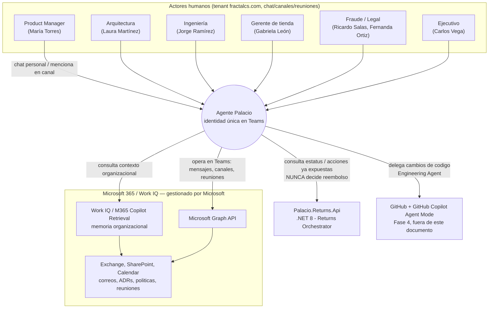
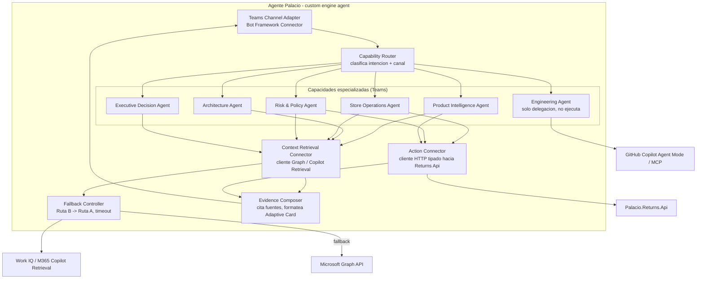
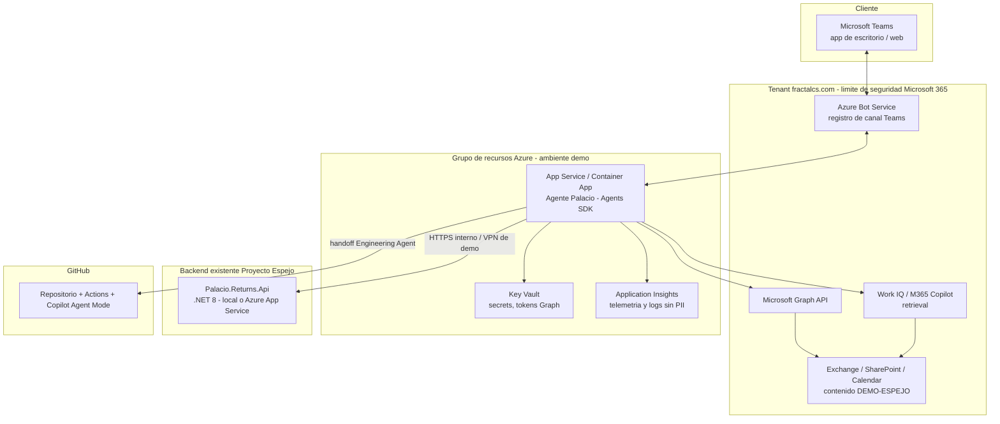
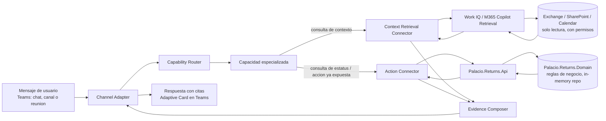
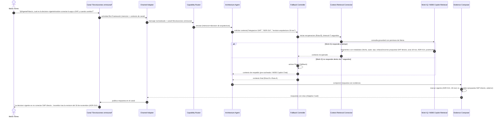
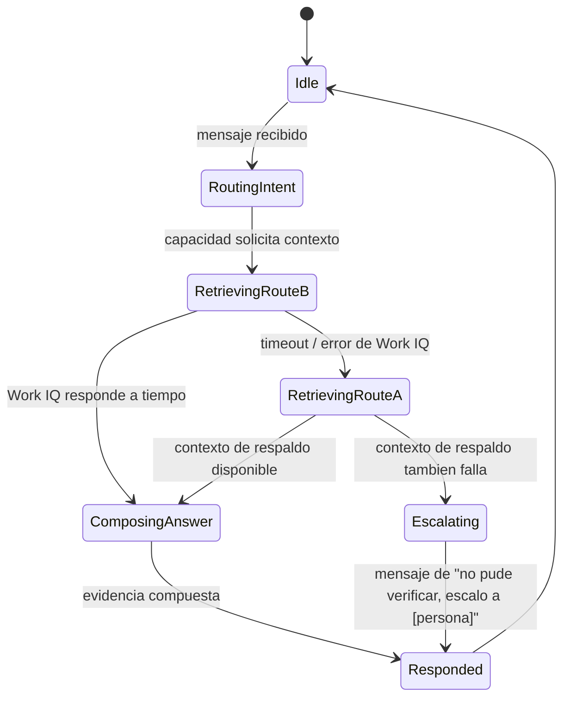
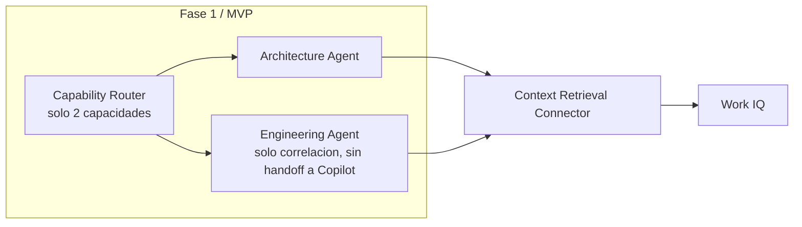

# Agente Palacio — Architecture Plan

**Documento**: Arquitectura de la superficie "Agente Palacio" (bot de Microsoft Teams), Fase 2 de
la iniciativa Inteligencia Palacio.
**Alimenta a**: BRD-2 (Agente Palacio) que escribirá `product-strategist`.
**Fuentes**: `historia.md` §5 y §8, `specs/inteligencia-palacio/vision-scope.md` (Fase 2, §4),
`docs/constitution.md`, `docs/adr/ADR-014-returns-orchestration.md`,
`docs/runbooks/incident-2025-11-return-fraud.md`, `.github/copilot-instructions.md`,
`src/Palacio.Returns.Api/Controllers/ReturnsController.cs`.
**Fecha**: 2026-07-22
**Status**: Borrador — para revisión de `system-architect` y `security-analyst`.

---

## Executive Summary

El Agente Palacio es una identidad conversacional única en Microsoft Teams que enruta internamente
a un subconjunto de las "capacidades especializadas" de Inteligencia Palacio (Product Intelligence,
Architecture, Store Operations, Risk & Policy, Engineering-delegation, Executive Decision). Vive en
chat personal, 5 canales del Team "Commerce Experience — Palacio de Hierro" y reuniones.

La decisión arquitectónica central de este documento es un boundary de tres partes, no negociable
(consistente con ADR-014 y `docs/constitution.md` §2.2):

1. **El bot orquesta la conversación** (enrutamiento de intención, composición de respuesta con
   evidencia, manejo de fallback) — no tiene memoria propia ni lógica de negocio.
2. **Work IQ / Microsoft 365 Copilot recupera contexto organizacional** (correos, SharePoint, ADRs,
   reuniones) — el bot lo consume como servicio de recuperación, nunca lo indexa ni lo duplica.
3. **`Palacio.Returns.Api` ejecuta y decide la lógica de negocio de devoluciones** — el bot consulta
   estatus y aciones ya expuestas; **nunca** decide elegibilidad, aprobación de inspección ni
   reembolso.

Se recomienda construir el bot con **Microsoft 365 Agents SDK / Teams AI Library** (custom engine
agent) en vez de Microsoft Copilot Studio, priorizando control fino sobre el enrutamiento a 6
capacidades y sobre la lógica de fallback Ruta B → Ruta A, a costa de mayor esfuerzo de desarrollo
frente a una solución low-code.

---

## Decisión de Framework (responde Pregunta Abierta #1 del vision-scope)

### Recomendación: Microsoft 365 Agents SDK / Teams AI Library (custom engine agent)

| Criterio | Teams AI Library / Agents SDK | Microsoft Copilot Studio |
|---|---|---|
| Velocidad de desarrollo para una demo | Media — requiere código y hosting propio, pero el equipo ya opera en .NET 8 y puede reusar el SDK en C# | Alta — topics/generative answers configurables sin código, publica a Teams en minutos |
| Control fino sobre lógica conversacional | Alto — enrutamiento explícito a 6 capacidades, lógica de fallback Ruta B→A programable, respuestas deterministas a las 3 preguntas guion | Medio-bajo — "generative answers" es más RAG genérico; difícil garantizar que la respuesta a una pregunta guion específica sea siempre la misma y con la evidencia exacta requerida |
| Integración con Work IQ / Microsoft Graph | Alta — SDK de Graph y Microsoft 365 Copilot Retrieval API se invocan directo desde el código del bot; control total sobre qué se pide y cómo se cita | Media — Copilot Studio conecta "knowledge sources" (SharePoint, conectores de Graph) pero la composición de la cita/evidencia es menos controlable |
| Integración con `Palacio.Returns.Api` | Alta — llamada HTTP tipada directa, reusando DTOs igual que haría cualquier otro cliente .NET | Media — requiere un custom connector / Power Automate flow como capa intermedia, plumbing adicional |
| Testabilidad / control de versión en git | Alta — código versionable en el mismo repo o uno paralelo, testeable con xUnit/Jest como cualquier otro componente | Baja-media — el "solution" de Copilot Studio se exporta como paquete; versionado y testing automatizado son más ásperos |
| Riesgo de fallo en vivo | Menor si se implementa fallback explícito en código | Mayor — timeouts de "generative answers" no son controlables desde fuera |
| Costo/esfuerzo de hosting | Requiere Azure Bot Service + App Service/Container App + Key Vault | Ninguno adicional — Copilot Studio gestiona el runtime |

**Por qué Teams AI Library gana para este caso concreto**: el vision-scope fija criterios de éxito
muy específicos y verificables — el agente debe responder con evidencia verificable a **preguntas
guion exactas** (reconstrucción del proceso, contradicción SAP-directo-vs-ADR-014, memoria del
incidente de noviembre) y distinguir explícitamente vigente vs. obsoleto. Esto exige control fino
sobre qué se recupera, cómo se cita, y qué pasa si Work IQ no responde — no una respuesta genérica
de "generative answers". El riesgo de que Copilot Studio produzca una respuesta plausible pero sin
la evidencia exacta requerida en una demo ejecutiva en vivo es más alto que el costo adicional de
escribir el orquestador a mano.

**Cuándo reconsiderar**: si la Pregunta Abierta #4 (fecha de la presentación) resuelve un plazo muy
corto (días, no semanas) y el equipo de ingeniería es reducido, Copilot Studio es la alternativa de
respaldo razonable — se sacrifica precisión determinista por velocidad de entrega. Esta decisión
debe registrarse como ADR una vez que el stakeholder confirme fecha y capacidad del equipo.

**Nota sobre un tercer camino no pedido explícitamente pero relevante**: existe un patrón híbrido —
"declarative agent para Microsoft 365 Copilot con API plugins" — que obtiene grounding nativo en
Work IQ sin construir el pipeline de recuperación a mano, y añade acciones custom vía plugin hacia
`Palacio.Returns.Api`. No se recomienda como opción principal aquí porque el enrutamiento a 6
capacidades especializadas con lógica de fallback determinista es más natural de expresar en código
propio (Agents SDK) que dentro de las restricciones de un declarative agent. Vale la pena una prueba
de concepto corta si el tiempo lo permite, pero no debe bloquear la decisión.

---

## System Context

### Overview
El Agente Palacio es el punto de entrada conversacional para 6 roles humanos dentro de Teams. No
posee lógica de negocio propia: actúa como intermediario entre las personas, la memoria
organizacional (Work IQ/Microsoft Graph) y el motor de reglas de devoluciones
(`Palacio.Returns.Api`). La delegación de cambios de código a GitHub Copilot es un boundary de
salida hacia la Fase 4, fuera de detalle en este documento.

### Componentes clave
- **Actores humanos**: los 6 roles de Teams del vision-scope (Concierge Postcompra y Store
  Associate Copilot viven en otras superficies, fuera de este contexto).
- **Agente Palacio**: única identidad visible; internamente enruta a capacidades.
- **Work IQ / Microsoft Graph**: sistemas externos gestionados por Microsoft, tratados como
  cajas negras de recuperación con permisos.
- **Palacio.Returns.Api**: sistema existente, dueño exclusivo de las reglas de negocio.
- **GitHub + Copilot Agent Mode**: boundary de salida hacia Fase 4, no detallado aquí.

### Relaciones
El bot es el único componente que conversa con humanos; todo lo demás son servicios que consulta,
nunca al revés (ningún sistema externo inicia conversación directamente con el usuario sin pasar
por el bot, salvo notificaciones nativas de Teams/Outlook que ya existen hoy).

### Decisiones de diseño
- Una sola identidad de bot para 6 capacidades evita fragmentar la experiencia de Teams en múltiples
  apps instaladas — decisión ya fijada en `historia.md` §5, este documento solo la traduce a
  arquitectura.
- El bot no debe implementarse como un simple "wrapper de M365 Copilot Chat" porque necesita
  enrutamiento propio a capacidades y acciones custom contra `Palacio.Returns.Api`.

### NFR
- **Escalabilidad**: no relevante a escala de demo (decenas de usuarios ficticios); diseño no debe
  bloquear escalar a un Team real más adelante (fuera de alcance).
- **Performance**: ver Fallback Controller — objetivo de respuesta perceptible en demo en vivo.
- **Seguridad**: el bot opera con permisos delegados/de aplicación acotados al tenant
  `fractalcs.com`, respetando `employeeType=DEMO-ESPEJO` (constitución §7.1); nunca usa una cuenta
  con permisos más amplios de los necesarios para leer Graph y llamar a la API.
- **Confiabilidad**: fallback explícito Ruta B → Ruta A (ver diagrama de estados).
- **Mantenibilidad**: capacidades como módulos independientes facilita agregar canales/roles nuevos.

### Trade-offs
Concentrar 6 capacidades en un solo bot simplifica la experiencia de usuario pero centraliza el
riesgo: un fallo en el Capability Router afecta las 6 capacidades a la vez. Se mitiga con
degradación por capacidad (ver Component Architecture).

### Riesgos y mitigaciones
| Riesgo | Mitigación |
|---|---|
| El bot "alucina" evidencia si Work IQ no la provee | Evidence Composer rechaza responder sin al menos una fuente citable; si no hay evidencia, responde "no encontré evidencia verificable" en vez de inventar |
| Confusión entre capacidad y canal (ej. pregunta de riesgo en canal de operaciones) | Capability Router considera tanto el canal como el contenido del mensaje, no solo el canal |

---

## Architecture Overview — Boundaries (ADR-014 aplicado al Agente Palacio)

| Vive en... | Responsabilidad | Nunca hace |
|---|---|---|
| **Agente Palacio (bot)** | Orquestación conversacional; enrutamiento a capacidad; composición de respuesta con evidencia; manejo de fallback Ruta B→A; invocar acciones ya expuestas por `Palacio.Returns.Api`; delegar a GitHub Copilot | Decidir elegibilidad, aprobación de inspección o reembolso; indexar/copiar contenido de M365 en almacenamiento propio; tratar `Received` como equivalente a `InspectionApproved` |
| **Work IQ / Microsoft 365 Copilot** | Recuperación de contexto organizacional con permisos (correos, SharePoint, calendario); distinguir vigente/obsoleto por metadatos y fecha | Ejecutar acciones de negocio; conocer las reglas de devoluciones |
| **`Palacio.Returns.Api` / `Palacio.Returns.Domain`** | Única fuente de verdad de elegibilidad, inspección, fraude, reembolso, QR (ya implementado) | Interpretar lenguaje natural; conocer el contenido de Teams o M365 |
| **GitHub Copilot Agent Mode (Fase 4)** | Convertir un hallazgo delegado desde Teams en código, pruebas y PR | Aprobar su propio PR; tomar decisiones de negocio sin referenciar ADR/incidente |

Esta tabla es el contrato que cualquier spec técnico derivado (BRD-2) debe respetar sin excepción.

---

## Component Architecture

### Overview
El bot se compone de un adaptador de canal, un enrutador de capacidad, seis manejadores de
capacidad especializados, dos conectores de salida (contexto y acción), un compositor de evidencia,
y un controlador de fallback. Todo el estado es efímero por conversación — no hay almacén de datos
propio del bot.

### Componentes clave
- **Teams Channel Adapter**: traduce actividades del Bot Framework (mensajes, menciones, eventos de
  reunión) a un modelo interno; es la única puerta de entrada/salida hacia Teams.
- **Capability Router**: clasifica el mensaje (canal + intención) y despacha a uno de los 6
  manejadores. Regla: el canal es una señal fuerte pero no exclusiva (ver riesgo arriba).
- **Capacidades especializadas**: cada una encapsula el *prompt/instrucciones* y las *fuentes*
  relevantes para su rol narrativo (ej. Architecture Agent prioriza ADRs y actas de arquitectura;
  Risk & Policy Agent prioriza políticas y reglas de fraude). Ninguna capacidad implementa lógica de
  negocio — todas delegan a Context Retrieval Connector o Action Connector.
- **Engineering Agent**: es la única capacidad que no llama a Context/Action Connector para
  responder — su función es *delegar* (handoff) hacia GitHub Copilot Agent Mode/MCP; el detalle de
  esa mecánica es Fase 4 y no se diseña aquí.
- **Context Retrieval Connector**: cliente de Microsoft Graph / Microsoft 365 Copilot Retrieval API;
  recibe una consulta y devuelve fragmentos con metadatos de fuente (tipo, fecha, autor, enlace).
- **Action Connector**: cliente HTTP tipado hacia `Palacio.Returns.Api`, reusando los DTOs ya
  definidos en `Api/DTOs` (mismo patrón que cualquier otro consumidor .NET del API).
- **Evidence Composer**: reglas de presentación — nunca responde sin al menos una fuente citable;
  marca explícitamente cuando una fuente está "vigente" vs. "obsoleta" según metadatos de fecha.
- **Fallback Controller**: temporizador + lógica de conmutación Ruta B → Ruta A (ver diagrama de
  estados en la sección de Data Flow).

### Relaciones
El Router nunca llama directamente a los conectores — siempre pasa por una capacidad, que decide
qué y cómo pedir. Esto mantiene la lógica de "qué fuentes priorizar por rol" encapsulada por
capacidad, no dispersa en el conector genérico.

### Decisiones de diseño
- Separar **Context Retrieval Connector** de **Action Connector** reproduce exactamente el boundary
  de la tabla anterior: uno solo lee memoria organizacional, el otro solo invoca acciones ya
  aprobadas del dominio de devoluciones. Ningún componente combina ambas responsabilidades.
- El **Evidence Composer** es un componente compartido (no una capacidad) porque el requisito de
  "nunca responder sin evidencia" y "distinguir vigente/obsoleto" es transversal a las 6
  capacidades, no específico de una — repetirlo por capacidad arriesgaría inconsistencia.

### NFR
- **Escalabilidad**: cada capacidad es un módulo independiente — agregar una séptima capacidad no
  toca las demás.
- **Performance**: Context Retrieval Connector y Action Connector deben poder invocarse en paralelo
  cuando una capacidad necesita ambos (ej. Store Operations Agent respondiendo sobre readiness de
  tienda + estatus de un caso).
- **Seguridad**: Action Connector nunca expone al bot un token con permisos más allá de los
  endpoints ya documentados de `Palacio.Returns.Api`; Context Retrieval Connector respeta los
  permisos de Graph del usuario que pregunta (no debe "ver más" de lo que el usuario vería en M365).
- **Confiabilidad**: Fallback Controller aísla el fallo de Work IQ del resto del pipeline.
- **Mantenibilidad**: agregar un canal nuevo de Teams solo requiere una entrada de configuración en
  el Router, no cambios en las capacidades.

### Trade-offs
Tener 6 capacidades como módulos separados incrementa el número de componentes a mantener frente a
un único prompt monolítico — se acepta porque mejora la trazabilidad de qué capacidad respondió qué,
algo que la demo necesita para ser creíble (poder explicar el diseño si se pregunta).

### Riesgos y mitigaciones
| Riesgo | Mitigación |
|---|---|
| Engineering Agent termina reimplementando lógica de negocio para "responder más rápido" sin pasar por GitHub Copilot | Regla dura en `copilot-instructions.md`/constitución: Engineering Agent solo delega, nunca ejecuta cambios directamente |
| Action Connector se usa para intentar "aprobar" algo | Action Connector solo expone verbos ya existentes en `Palacio.Returns.Api` (iniciar, recibir, decidir inspección — ejecutados por humanos vía POS/Operations Console, no por el bot en nombre de nadie); el bot no tiene un endpoint de "aprobar reembolso" que invocar porque no existe ni debe existir |

---

## Deployment Architecture

### Overview
Despliegue proporcional a demo: un solo ambiente ("demo"), sin alta disponibilidad ni multi-región.
El bot corre en Azure; `Palacio.Returns.Api` puede correr localmente (`dotnet run`) o en Azure App
Service según la Pregunta Abierta #3 del vision-scope.

### Componentes clave
- **Azure Bot Service**: registro de canal que conecta Teams con el endpoint del bot (requiere
  Azure AD App Registration — secrets en Key Vault, nunca hardcodeados, consistente con
  `docs/constitution.md` §5.3).
- **App Service / Container App**: hospeda el proceso del Agents SDK; único componente con código
  propio de este documento.
- **Palacio.Returns.Api**: sin cambios de despliegue respecto a Fase 0, salvo que se decida
  exponerlo en Azure para que el bot lo alcance sin depender de una laptop encendida durante la
  demo (recomendado si la presentación es remota).

### Relaciones
El bot nunca se conecta directo a Exchange/SharePoint — siempre vía Graph/Work IQ. El bot nunca se
conecta a una base de datos de devoluciones — siempre vía `Palacio.Returns.Api` HTTP.

### Decisiones de diseño
- Un solo ambiente "demo" (no dev/staging/prod) es intencional: no hay usuarios reales ni SLA que
  proteger (constitución §1, §5.2).
- `Palacio.Returns.Api` se trata como un límite de red separado del bot para mantener el boundary de
  ADR-014 visible también a nivel de despliegue, no solo de código.

### NFR
- **Escalabilidad**: no aplica (una instancia basta para una demo en vivo).
- **Performance**: colocar App Service y Returns Api en la misma región Azure si se despliega este
  último, para minimizar latencia de red durante la demo.
- **Seguridad**: Key Vault para secrets de Graph/Bot Framework; Application Insights configurado
  sin loggear contenido de mensajes de usuario (solo metadatos), consistente con constitución §7.3.
- **Confiabilidad**: sin failover automático — se acepta explícitamente (demo, no producción); la
  mitigación real de confiabilidad vive en la lógica de fallback Ruta B→A del propio bot, no en
  redundancia de infraestructura.
- **Mantenibilidad**: separar recursos Azure en su propio grupo de recursos "demo" permite
  desmantelar todo post-presentación sin afectar el resto del tenant.

### Trade-offs
No hay ambiente de staging separado — se acepta el riesgo de probar cambios directo en el ambiente
de demo porque el volumen de usuarios y el ciclo de vida del proyecto no justifican el costo de un
segundo ambiente.

### Riesgos y mitigaciones
| Riesgo | Mitigación |
|---|---|
| `Palacio.Returns.Api` corriendo en una laptop se cae o pierde red durante la demo en vivo | Desplegar una instancia de respaldo en Azure App Service antes de la presentación (decisión pendiente de Pregunta Abierta #3) |
| Secrets de Graph/Bot Framework expuestos accidentalmente en config commiteada | Regla ya vigente en constitución §5.3: nunca hardcodear, usar Key Vault/env vars/GitHub Actions secrets |

---

## Data Flow

### Overview
El flujo de datos separa claramente dos caminos de salida desde una capacidad: uno hacia memoria
organizacional (lectura, sin efectos secundarios) y otro hacia acciones de negocio (lectura de
estatus, ejecución de verbos ya existentes) — nunca se cruzan ni se combinan en un solo store.

### Componentes clave / fuentes y destinos
- **Fuente 1 (memoria organizacional)**: Exchange, SharePoint, Calendar — solo lectura, sin
  modificación desde el bot.
- **Fuente 2 (estatus de negocio)**: `Palacio.Returns.Domain` vía `Palacio.Returns.Api` — solo
  lectura de estatus con los verbos ya existentes; ninguna transformación de reglas de negocio
  ocurre en el bot.
- **Destino**: Teams (mensaje/Adaptive Card), siempre con evidencia citada.

### Relaciones
Ninguna de las dos fuentes se persiste dentro del proceso del bot más allá de la vida de una sola
conversación — no existe una base de datos propia del Agente Palacio.

### Decisiones de diseño
No introducir una caché/almacén propio de contexto organizacional evita duplicar la "fuente de
verdad" que Work IQ ya representa — si el bot cacheara agresivamente correos/documentos, se
arriesgaría a mostrar información obsoleta como si fuera vigente, contradiciendo el criterio de
éxito #3 del vision-scope ("distingue vigente de obsoleto").

### NFR
- **Escalabilidad**: sin estado persistente, cualquier instancia del bot puede atender cualquier
  conversación.
- **Performance**: las dos consultas (contexto y acción) pueden dispararse en paralelo cuando una
  capacidad las necesita ambas.
- **Seguridad**: los datos que fluyen desde M365 respetan los permisos del usuario que pregunta;
  los datos desde `Palacio.Returns.Api` no incluyen PII real (todo es sintético, constitución §7.1).
- **Confiabilidad**: ver Fallback Controller (siguiente diagrama).
- **Mantenibilidad**: agregar una tercera fuente de datos (ej. GitHub para Engineering Agent) sigue
  el mismo patrón de conector dedicado, sin tocar el Evidence Composer.

### Trade-offs
No cachear contexto organizacional implica que cada pregunta paga el costo de latencia de una
llamada a Work IQ — aceptable para una demo de volumen bajo, no aceptable si esto escalara a
producción con muchos usuarios concurrentes (fuera de alcance).

### Riesgos y mitigaciones
| Riesgo | Mitigación |
|---|---|
| El bot mezcla datos de estatus de devolución con contexto organizacional en una sola respuesta sin dejar claro cuál es cuál | Evidence Composer etiqueta cada fragmento de evidencia con su fuente (Work IQ vs. Returns Api) explícitamente en la respuesta |

---

## Key Workflows

### Escenario: María pregunta sobre la contradicción SAP-directo-vs-ADR-014 en el canal `Devoluciones omnicanal`

### Overview
Este es el escenario guion central del vision-scope (criterio de éxito de Fase 2). Ilustra el
camino feliz (Ruta B) y el fallback (Ruta A) cuando Work IQ no responde a tiempo.

### Componentes clave
Ver Component Architecture — este flujo activa Architecture Agent, no las otras 5 capacidades.

### Relaciones
El `alt/else` del diagrama es el corazón del NFR de confiabilidad: la conversación con María nunca
se cae por completo, se degrada a Ruta A.

### Decisiones de diseño
El timeout (`T`) se decide a nivel de demo, no de SLA productivo — ver NFR de Performance más abajo.
La capacidad (`ArchCap`) nunca ve la diferencia entre Ruta A y Ruta B — recibe "contexto final" de
forma uniforme, lo que mantiene la lógica de composición de evidencia simple y sin ramas duplicadas.

### NFR
- **Performance**: objetivo de demo — indicador de "escribiendo..." inmediato (<1s), respuesta final
  ideal en 5-8s, timeout duro de fallback en ~6s para no dejar a la audiencia esperando.
- **Confiabilidad**: Ruta A garantiza que siempre hay una respuesta, aunque menos rica en evidencia
  en vivo.
- **Seguridad**: la consulta a Work IQ respeta los permisos de María — el bot no "ve más" de lo que
  ella vería directamente en M365 Copilot Chat.
- **Mantenibilidad**: el mismo patrón de secuencia aplica a las otras dos preguntas guion
  (reconstrucción del proceso vigente, memoria del incidente de noviembre) cambiando solo la
  capacidad y la consulta de contexto.

### Trade-offs
Fijar un timeout corto (~6s) para mantener el ritmo de la demo arriesga activar Ruta A incluso
cuando Work IQ habría respondido correctamente un poco más tarde — se acepta porque en una demo en
vivo la percepción de fluidez importa más que agotar el intento óptimo.

### Riesgos y mitigaciones
| Riesgo | Mitigación |
|---|---|
| Ruta A (fallback) no tiene evidencia tan rica como Ruta B y decepciona en el momento clave de la demo | Pre-cachear explícitamente el contexto de las 3 preguntas guion como contenido de respaldo curado (no genérico) para Ruta A, ensayado antes de la presentación — consistente con `historia.md` §11 Fase 4 |
| El presentador no sabe si el sistema usó Ruta A o Ruta B en vivo | Application Insights registra qué ruta se usó por interacción (sin loggear contenido sensible) para post-mortem del ensayo |

---

## Additional Diagram: Fallback Controller (State Diagram)

### Overview
Modela explícitamente la mitigación de fallas de Work IQ pedida en los requisitos de este documento.

### NFR
- **Confiabilidad**: el estado `Escalating` es el piso de seguridad — el bot nunca inventa evidencia
  cuando ambas rutas fallan; escala explícitamente a una persona (consistente con el patrón ya
  descrito en `historia.md` §3.1 "escalar a un asesor humano").

---

## Phased Development

### Phase 1 / MVP (alineado con el criterio de éxito de Fase 2 del vision-scope)
- Solo 2 de las 6 capacidades activas: **Architecture Agent** y (para el canal Incidentes
  digitales) una versión reducida de **Engineering Agent** limitada a correlacionar evidencia, sin
  aún delegar a GitHub Copilot desde Teams (eso es Fase 4).
- Solo 2 canales conectados: `Devoluciones omnicanal` e `Incidentes digitales`.
- Fallback Ruta A implementado como contenido pre-cacheado curado para las 3 preguntas guion
  exactas — no un fallback genérico.
- Sin chat personal ni reuniones todavía.
- Sin extensión de `Palacio.Returns.Api` — Action Connector no se usa en el MVP porque las 3
  preguntas guion del MVP son puramente de memoria organizacional, no de estatus de devolución.

### Phase 2+ / Arquitectura Final (Target descrito en este documento)
- Las 6 capacidades activas.
- Los 5 canales del Team respondiendo de forma diferenciada.
- Chat personal habilitado (consultas del tipo "qué tengo pendiente hoy").
- Participación en reuniones (preparación/seguimiento).
- Action Connector activo contra `Palacio.Returns.Api`, incluyendo la extensión de solo lectura
  pendiente (ver Gaps).
- Engineering Agent con handoff real a GitHub Copilot Agent Mode desde un hilo de Teams (Fase 4 del
  vision-scope).

### Migration Path
1. Construir Channel Adapter + Router + Evidence Composer + Fallback Controller una sola vez — no
   cambian entre MVP y Target.
2. Agregar capacidades una por una (Product Intelligence, Store Operations, Risk & Policy,
   Executive Decision) reusando el mismo patrón que Architecture Agent.
3. Agregar Action Connector cuando se decida extender `Palacio.Returns.Api` con el endpoint de
   consulta de estatus (ver Gaps) — esto desbloquea Store Operations Agent y Risk & Policy Agent
   respondiendo con datos reales de un caso.
4. Habilitar chat personal y reuniones como canales adicionales del mismo Channel Adapter (Bot
   Framework ya soporta ambos tipos de conversación con la misma app registration).
5. Conectar el handoff real de Engineering Agent a GitHub Copilot Agent Mode (Fase 4) — mecánica ya
   validada en Fase 0 vía VS Code, solo se agrega el punto de entrada desde Teams.

---

## NFR Analysis (consolidado)

| NFR | Objetivo para esta demo |
|---|---|
| Escalabilidad | No es un requisito real — decenas de usuarios ficticios, una instancia basta. El diseño (capacidades como módulos, sin estado persistente) no bloquea escalar después si se decidiera, pero no se optimiza para ello ahora. |
| Performance | Indicador de actividad inmediato (<1s); respuesta final objetivo 5-8s en camino feliz; timeout de fallback ~6s; nunca dejar al usuario sin respuesta. |
| Seguridad | Respeta permisos de Graph del usuario que pregunta; secrets en Key Vault; nunca mezclar cuentas ficticias `DEMO-ESPEJO` con actividad real del tenant; el bot nunca decide reembolso (ADR-014). |
| Confiabilidad | Fallback Ruta B→A explícito con piso de escalamiento a humano; sin evidencia inventada. |
| Mantenibilidad | Capacidades como módulos independientes; conectores de contexto y acción separados y reemplazables sin tocar el resto. |

---

## Risks & Mitigations (consolidado, no repetido de secciones previas)

| Riesgo | Impacto | Mitigación |
|---|---|---|
| No existe endpoint de consulta de estatus (`GET`) en `Palacio.Returns.Api` hoy — solo verbos `POST` de creación/recepción/inspección/QR | Bloquea que Store Operations Agent y Risk & Policy Agent respondan con datos reales de un caso de devolución | Extender `Palacio.Returns.Api`/`Domain` con un endpoint de solo lectura (proyección, no regla de negocio nueva) siguiendo el mismo patrón en capas ya fijado — a definir en un spec técnico separado, no en este documento |
| Elección de framework (esta decisión) se toma tarde y bloquea el diseño detallado del BRD-2 | Retrasa toda la Fase 2 | Este documento resuelve la Pregunta Abierta #1 con una recomendación concreta y trade-offs explícitos, lista para que el stakeholder apruebe o pida ajuste |
| El fallback Ruta A se improvisa en vivo en vez de pre-cachearse | Falla visible ante audiencia ejecutiva | Pre-cachear y ensayar explícitamente el contenido de Ruta A para las 3 preguntas guion antes de la presentación |

---

## Technology Stack Recommendations

- **Framework de agente**: Microsoft 365 Agents SDK / Teams AI Library (custom engine agent),
  preferentemente en C# para reusar convenciones y familiaridad del equipo con .NET 8 (aunque el
  SDK también soporta TypeScript/Python si el equipo de bot es distinto al de backend).
- **Hosting**: Azure Bot Service (registro de canal) + Azure App Service o Container App (proceso
  del bot) — mismo patrón "sin Docker/Kubernetes salvo necesidad concreta" de `docs/constitution.md`
  §5.2; usar App Service simple si no hay necesidad narrativa de contenedores.
- **Recuperación de contexto**: Microsoft Graph SDK + Microsoft 365 Copilot Retrieval API (o
  conectores de Graph equivalentes disponibles en el tenant) — no reconstruir un pipeline de
  búsqueda propio sobre el contenido de M365.
- **Cliente hacia `Palacio.Returns.Api`**: `HttpClient` tipado reusando los DTOs ya definidos en
  `Api/DTOs`, igual convención que cualquier otro consumidor .NET del API.
- **Observabilidad**: Application Insights, sin loggear contenido de mensajes de usuario (solo
  metadatos: capacidad invocada, ruta usada B/A, latencia).
- **Secrets**: Azure Key Vault, nunca en `appsettings` ni commiteados (constitución §5.3).

---

## Next Steps

1. **Aprobación del stakeholder** sobre la decisión de framework (Pregunta Abierta #1) — este
   documento la recomienda pero no la aprueba por sí mismo.
2. **`system-architect`**: revisar boundaries de este documento contra el resto de la arquitectura
   del repo (contratos de `Palacio.Returns.Api`, coherencia con Mi Palacio y Operations Console).
3. **`security-analyst`**: modelar amenazas STRIDE sobre el bot — en particular permisos de Graph,
   manejo de secrets, y el límite "el bot nunca decide reembolso".
4. **`spec-author`**: una vez aprobado, escribir el BRD-2 / spec técnico de Fase 2 basado en este
   diseño, incluyendo el spec de extensión de `Palacio.Returns.Api` (endpoint de solo lectura)
   identificado como gap.

---

## Historial de Revisiones

| Fecha | Autor | Cambio |
|---|---|---|
| 2026-07-22 | Claude (cloud-architect) | Versión inicial. |
