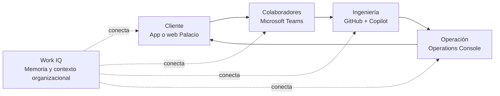
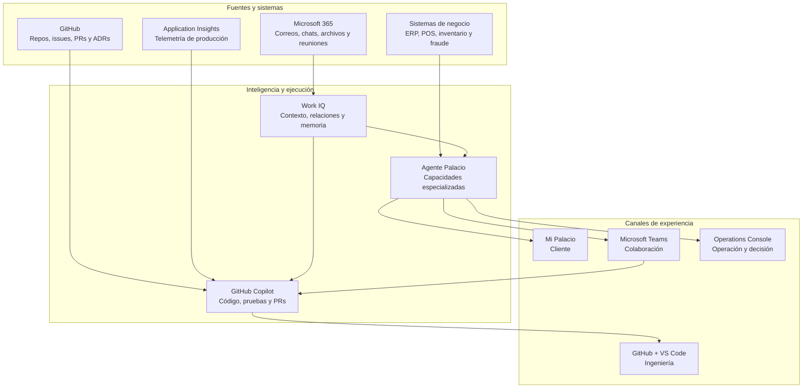
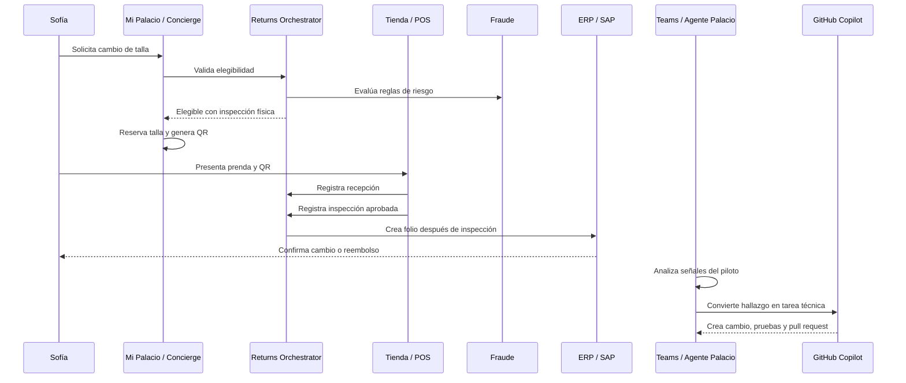

# Propuesta de demo: Inteligencia Palacio

## Work IQ + GitHub Copilot para El Palacio de Hierro

**Concepto rector:** una experiencia de lujo conectada, desde la intención del cliente hasta la ejecución operativa y tecnológica.

---

## 1. Resumen ejecutivo

Esta propuesta no plantea una demostración tradicional de inteligencia artificial ni una sesión de autocompletado de código. Plantea una historia sobre cómo El Palacio de Hierro puede convertir el conocimiento disperso de la organización en decisiones y acciones coordinadas.

La pregunta que guía la demostración es:

> **¿Qué pasaría si Palacio de Hierro tuviera memoria y pudiera convertirla en acción?**

La historia conecta cinco superficies:

1. **Web de Palacio:** comprende la intención del cliente y resuelve su necesidad con certeza y personalización.
2. **Microsoft Teams:** conecta personas, conversaciones, decisiones, archivos, reuniones y sistemas empresariales.
3. **GitHub y GitHub Copilot:** convierte el contexto del negocio en software, pruebas y pull requests verificables.
4. **Azure Application Insights:** muestra lo que el sistema está haciendo de verdad en producción, más allá de lo que la aplicación reporta como error.
5. **Palacio Operations Console:** convierte señales operativas en seguimiento, aprobación y decisiones de rollout.

Work IQ funciona como la capa de inteligencia transversal que relaciona el conocimiento de Microsoft 365 con las personas, las decisiones y el trabajo. GitHub Copilot actúa como el ejecutor que transforma ese contexto en cambios de software alineados con el negocio — y, con la telemetría a la mano, también como el que se da cuenta de que un control dejó de cumplirse.

> **Work IQ es la memoria organizacional. GitHub Copilot es el ejecutor. Uno entiende; el otro construye. Y juntos vigilan que lo construido siga honrando lo que se decidió.**

---

## 2. La visión omnicanal

La experiencia se diseña alrededor del canal natural de cada persona:

| Audiencia | Superficie principal | Necesidad | Experiencia de IA |
|---|---|---|---|
| Cliente | Web de Palacio | Resolver una compra, cambio o devolución | Concierge Postcompra |
| Asociado de tienda | Web operativa de tienda | Ejecutar el proceso con claridad | Store Associate Copilot |
| Gerente de tienda | Teams + Operations Console | Coordinar capacidad y preparación | Store Operations Agent |
| Product Manager | Teams + Copilot | Reconstruir contexto y definir producto | Product Intelligence Agent |
| Arquitectura | Teams + GitHub/VS Code | Proteger decisiones y estándares | Architecture Agent |
| Ingeniería | GitHub Copilot + Teams | Convertir decisiones en software | Engineering Agent |
| Fraude, Legal y Compliance | Teams + expediente web | Evaluar reglas, riesgo y excepciones | Risk & Policy Agent |
| Ejecutivo | Command Center + Teams | Entender resultados y decidir | Executive Decision Agent |

La experiencia completa sigue este principio:

> **El cliente inicia en la web de Palacio. Los colaboradores coordinan y deciden en Teams. Los equipos de tienda ejecutan desde una experiencia operativa. GitHub Copilot transforma las decisiones en software.**



---

## 3. Historia central: el vestido antes de la gala

La clienta ficticia **Sofía de la Garza** compra en línea un vestido para una gala. Al recibirlo, descubre que la talla no le queda bien. La gala es el sábado y necesita resolverlo rápidamente.

Sofía quiere saber:

- si puede devolver o cambiar el vestido;
- en qué tienda puede hacerlo;
- qué necesita llevar;
- cuándo recibirá el reembolso;
- si existe otra talla disponible;
- si pueden reservarle el reemplazo.

La intención real no es “devolver un vestido”. Es **tener el vestido correcto antes de su evento**. La experiencia de lujo consiste en comprender esa intención y darle certeza de principio a fin.

### 3.1 Escena del cliente

En el detalle de la compra aparece:

> **¿Necesitas ayuda con esta compra?**

Sofía conversa con el **Concierge Postcompra**.

**Sofía:**

> El vestido no me quedó y lo necesito para una gala el sábado.

**Concierge:**

> Puedo ayudarte a cambiarlo o devolverlo. La talla 6 está disponible en Palacio Polanco y puedo solicitar que la reserven mientras llevas la talla 4. Por el tipo y valor del artículo, un asesor deberá revisar físicamente la prenda. ¿Quieres iniciar el cambio?

El agente puede:

- validar elegibilidad;
- consultar inventario;
- recomendar cambio antes que reembolso;
- seleccionar una tienda;
- generar un QR;
- reservar temporalmente la nueva talla;
- agendar una visita;
- enviar instrucciones;
- proporcionar estatus;
- escalar a un asesor humano.

### 3.2 Momento de lujo digital

La clienta recibe una confirmación concreta:

> **Talla 6 reservada hasta mañana, 6:00 p. m.**  
> Palacio Polanco  
> Tiempo estimado del proceso: 12 minutos  
> Lleva la prenda, las etiquetas y este QR.

El valor no es únicamente automatizar una devolución. Es ofrecer **certeza, personalización y continuidad** entre el canal digital y la tienda.

---

## 4. El recorrido interno: Proyecto Espejo

La experiencia del cliente activa la historia interna denominada:

> **Proyecto Espejo — Devolución omnicanal de productos de lujo**

María Torres acaba de incorporarse como Product Manager de Comercio Digital. Recibe una petición ejecutiva: permitir que un cliente compre en línea, inicie una devolución desde la app y entregue el producto en cualquier tienda Palacio de Hierro.

Parece una funcionalidad sencilla, pero la organización ya ha discutido el tema y existe conocimiento distribuido:

- una política comercial vigente y otra obsoleta;
- restricciones para productos de lujo;
- una decisión de arquitectura;
- una integración incompleta con ERP/SAP;
- un incidente anterior;
- preocupaciones de fraude;
- un prototipo abandonado;
- una API parcialmente construida;
- varias personas que poseen fragmentos del conocimiento.

La misión de María es responder:

> **¿Cómo funciona actualmente la devolución omnicanal y qué debemos considerar para implementarla desde la app?**

La información no está perdida. **Está escondida** entre correos, chats, reuniones, documentos, código e historia operativa.

---

## 5. Diseño de agentes en Microsoft Teams

Teams es la puerta de entrada para el colaborador. En lugar de presentar muchos bots desconectados, la propuesta utiliza una identidad visible:

# Agente Palacio

Detrás de esta identidad existen capacidades especializadas —producto, arquitectura, operación, riesgo e ingeniería— que comparten una inteligencia común: **Inteligencia Palacio**.

El Agente Palacio participa de tres maneras:

1. **Chat personal:** consultas privadas, preparación y seguimiento individual.
2. **Canales de Teams:** colaboración, análisis y decisiones compartidas.
3. **Reuniones:** preparación, seguimiento y conversión de acuerdos en acciones.

### 5.1 Chat personal

Ejemplos de solicitudes:

- “¿Qué tengo pendiente hoy?”
- “Prepárame para la reunión de devoluciones.”
- “¿Qué decisiones se tomaron sobre el piloto Polanco?”
- “¿Quién conoce mejor esta integración?”
- “Resume todo lo ocurrido con el incidente.”

### 5.2 Equipo y canales

Se crea un Team llamado:

> **Commerce Experience — Palacio de Hierro**

| Canal | Participantes | Función narrativa | Interacción principal |
|---|---|---|---|
| `Devoluciones omnicanal` | Producto, CX, Ingeniería, Arquitectura, Operaciones, Fraude, ERP y Legal | Reconstruir el contexto y tomar decisiones | El agente reúne decisiones, incidentes, restricciones y responsables |
| `Experiencia del cliente` | Producto, CX, Diseño y Operaciones | Convertir señales de clientes en objetivos de producto | El agente sintetiza necesidades y oportunidades |
| `Operaciones de tienda` | Gerentes, asociados, soporte y capacitación | Preparar y ejecutar el proceso en cada tienda | El agente responde con readiness, procedimientos y excepciones |
| `Incidentes digitales` | Ingeniería, Arquitectura, Producto y Operaciones | Responder a fallas con memoria histórica | El agente correlaciona despliegues, métricas, runbooks e incidentes |
| `Piloto Polanco` | Tienda, Producto, CX e Ingeniería | Capturar aprendizaje operativo | El agente agrupa feedback y propone prioridades |

### 5.3 Canal `Devoluciones omnicanal`

María inicia el hilo:

> Necesitamos habilitar el inicio de devoluciones desde la app.

Después pregunta:

> @AgentePalacio, antes de que diseñemos la solución, reúne todo lo que sepamos sobre devoluciones digitales, incluyendo decisiones anteriores, incidentes, restricciones y responsables.

El agente responde:

> Encontré tres decisiones relevantes:
>
> 1. La app no debe conectarse directamente a SAP.
> 2. Recibir físicamente el artículo no equivale a aprobar la inspección.
> 3. Las devoluciones superiores a MXN $25,000 requieren revisión adicional.
>
> La decisión sobre SAP cambió después de la revisión de arquitectura del 18 de noviembre. También encontré un incidente relacionado con la autorización anticipada de reembolsos.
>
> Personas recomendadas para esta decisión: Laura, Jorge, Ricardo, Gabriela y Daniel.

La respuesta incluye evidencia verificable —correos, ADR, reunión, política, postmortem y pull request— y queda dentro del lugar donde el equipo ya está tomando decisiones.

### 5.4 Canal `Experiencia del cliente`

El equipo pregunta:

> ¿Qué problemas mencionaron los clientes acerca de las devoluciones?

El agente sintetiza:

- no saber si el artículo será aceptado;
- trasladarse a una tienda sin certeza;
- no entender qué documentos necesitan;
- desconocer cuándo recibirán el reembolso;
- no poder asegurar un reemplazo antes de devolver el original.

La conclusión de producto es:

> No deberíamos optimizar únicamente el inicio de la devolución. Deberíamos proporcionar certeza antes de la visita y continuidad entre el canal digital y la tienda.

### 5.5 Canal `Operaciones de tienda`

El agente prepara briefings por tienda, identifica capacidades faltantes, genera materiales de capacitación y responde dudas operativas.

**Gerente de tienda:**

> @AgentePalacio, ¿podemos recibir este QR en Santa Fe?

**Agente Palacio:**

> Santa Fe todavía no tiene habilitado el nuevo lector. Para esta semana debe utilizarse el folio manual. El despliegue está programado para el jueves.

### 5.6 Canal `Incidentes digitales`

Este canal contiene el momento dramático de la historia:

> ⚠️ Incremento de errores en la creación de devoluciones digitales.

El agente reúne:

- el cambio desplegado;
- el pull request;
- métricas y momento de inicio;
- incidentes similares;
- responsables;
- conversaciones recientes;
- runbook e impacto.

Respuesta propuesta:

> El incremento comenzó 11 minutos después del despliegue del PR #82. El error ocurre cuando el POS reporta `received` antes de completar `inspectionApproved`. Existe un incidente similar documentado en noviembre.
>
> Recomiendo detener el rollout, activar el feature flag anterior, asignar la revisión a Jorge y Laura, corregir `Returns Orchestrator` y validar las pruebas de transición de estado.

### 5.7 Canal `Piloto Polanco`

Los asociados comparten señales operativas:

- “Tres clientes no encontraron el botón para descargar el QR.”
- “La reserva de inventario expiró antes de que el cliente llegara.”
- “Los asociados necesitan ver una fotografía del artículo.”

Al final del día se solicita:

> @AgentePalacio, resume el piloto, agrupa los problemas y recomienda prioridades.

El agente entrega problemas frecuentes, volumen, impacto, testimonios, hipótesis, recomendaciones y áreas responsables. También puede preparar historias de backlog o issues para GitHub.

---

## 6. Experiencias web

Teams sirve para conversar, coordinar y decidir. Las tareas visuales, estructuradas y transaccionales viven en dos experiencias web.

### 6.1 Web del cliente: Mi Palacio

Funciones:

- comprender la intención;
- ofrecer recomendaciones;
- validar elegibilidad;
- reservar inventario;
- generar QR;
- coordinar visita;
- mostrar estatus;
- escalar a una persona.

La experiencia evita exponer nombres de productos tecnológicos. Para el cliente, es simplemente una experiencia Palacio útil y elegante.

### 6.2 Palacio Operations Console

No es otro chat. Es un espacio de trabajo operativo que utiliza al Agente Palacio como acompañamiento contextual.

#### Módulo 1: Return Case 360

Cada devolución muestra:

- cliente y compra;
- producto e historial;
- elegibilidad;
- nivel de riesgo;
- tienda seleccionada;
- QR;
- inspección;
- reembolso;
- comunicaciones;
- decisiones del agente.

Pregunta contextual:

> ¿Por qué este caso requiere revisión?

Respuesta:

> El importe supera MXN $25,000 y el producto pertenece a una categoría de alto valor. La política vigente exige validación física y revisión adicional.

#### Módulo 2: Store Readiness

Mapa o tablero con:

- tiendas habilitadas;
- versión de POS;
- lectores QR;
- personal capacitado;
- incidencias;
- volumen;
- tiempo promedio;
- NPS;
- preparación para rollout.

Ejemplo:

> **¿Por qué Perisur está en amarillo?**  
> Porque 62% del personal completó la capacitación y quedan dos terminales con una versión anterior del POS.

#### Módulo 3: Experience Command Center

Indicadores:

- devoluciones iniciadas;
- cambios exitosos;
- llamadas evitadas;
- tiempo promedio;
- abandono;
- fraude detectado;
- satisfacción;
- problemas por tienda;
- tendencias y oportunidades.

El agente no se limita a describir métricas. Puede explicar una caída al correlacionar conversaciones de tienda, incidentes, cambios de interfaz, despliegues, tickets y reuniones.

#### Módulo 4: Decision Room

Presenta decisiones como:

> **¿Debemos extender el piloto a todas las tiendas?**

La vista reúne:

- recomendación;
- evidencia;
- métricas;
- riesgos;
- posiciones de las áreas;
- decisiones previas;
- dependencias;
- responsables;
- próximos pasos.

Acciones:

- aprobar rollout;
- extender piloto;
- solicitar controles adicionales;
- crear plan de remediación.

> **Teams es donde se discute. La web es donde se formaliza, aprueba y da seguimiento.**

---

## 7. Integración con GitHub Copilot

El diferenciador de la demostración es que la conversación no termina en una minuta: se convierte en un cambio de software verificable.

### 7.1 Del hilo de Teams al repositorio

En `Devoluciones omnicanal` o `Incidentes digitales`, Jorge escribe:

> @GitHub Copilot corrige el flujo para que el estado `received` nunca autorice el reembolso. Usa el contexto de este hilo y agrega pruebas de regresión para el incidente de noviembre.

GitHub Copilot utiliza:

- el contexto del hilo;
- el repositorio seleccionado;
- las instrucciones del repositorio;
- el historial del código;
- los criterios de aceptación;
- las reglas y decisiones relevantes.

Respuesta esperada:

> Inicié una sesión. Analizaré el flujo de transición de estados, agregaré pruebas y abriré un pull request para revisión.

Después informa:

> **Pull request creado: Prevent premature refund authorization**
>
> Cambios:
>
> - separación de `Received` e `InspectionApproved`;
> - bloqueo de autorización anticipada;
> - pruebas para artículos de alto valor;
> - prueba de regresión del incidente de noviembre;
> - actualización del ADR relacionado.
>
> Revisores sugeridos: Laura, Jorge y Ricardo.

### 7.2 Momento killer en VS Code

Jorge abre el repositorio y solicita:

> Analiza la petición de negocio para permitir que el cliente inicie una devolución desde la app. Consulta el contexto de Microsoft 365 relacionado con Proyecto Espejo, revisa las decisiones de arquitectura y el incidente de noviembre. Después inspecciona este repositorio y dime qué debemos cambiar antes de escribir código.

El resultado ideal identifica:

1. no integrar Mobile directamente con SAP;
2. utilizar Returns Orchestrator;
3. separar intención, recepción, inspección y reembolso;
4. aplicar revisión de fraude para alto valor;
5. generar QR con expiración de 72 horas;
6. considerar incompatibilidad de POS;
7. agregar pruebas que eviten repetir el incidente;
8. incluir a Laura, Ricardo, Daniel y Gabriela en la revisión.

Luego se solicita:

> Implementa el endpoint para iniciar una devolución desde la app, sin autorizar el reembolso. Agrega validación de elegibilidad, QR con expiración de 72 horas y pruebas. Crea también un borrador del pull request explicando qué decisiones de negocio y arquitectura respetaste.

GitHub Copilot:

- inspecciona el código;
- modifica el dominio;
- agrega el endpoint;
- genera y ejecuta pruebas;
- actualiza documentación;
- redacta el pull request;
- referencia el ADR;
- enumera riesgos y revisores.

> **Copilot no dedujo esto únicamente del código. Entendió por qué el código debe funcionar así.**

---

## 8. Narrativa de arquitectura

La demostración conecta tres mundos y una capa transversal.

### 8.1 Mundo del negocio

Microsoft 365 contiene:

- Outlook;
- Teams;
- SharePoint;
- Word, PowerPoint y Excel;
- reuniones, transcripciones y recaps;
- estructura organizacional;
- políticas, decisiones y compromisos.

### 8.2 Mundo de ingeniería

GitHub contiene:

- repositorio de la app;
- servicio de devoluciones;
- issues y pull requests;
- ADRs y documentación;
- pruebas;
- un bug e incidente históricos;
- instrucciones personalizadas para Copilot.

### 8.3 Mundo operacional

Los sistemas empresariales y la consola representan:

- órdenes y clientes;
- inventario;
- ERP/SAP;
- POS;
- reglas de fraude;
- inspección en tienda;
- notificaciones;
- métricas de experiencia y rollout.

### 8.4 Capa transversal

Work IQ conecta:

- quién sabe qué;
- qué información está vigente;
- qué cambió y cuándo;
- qué decisiones se tomaron;
- qué ocurrió anteriormente;
- qué conversaciones están relacionadas;
- qué personas deben participar;
- qué compromisos están pendientes.

A esa memoria organizacional se suma una segunda fuente de verdad, de naturaleza distinta: la
**telemetría de producción** (Azure Application Insights). Mientras Work IQ responde *qué
decidimos y por qué*, la telemetría responde *qué está pasando en realidad*. Ninguna de las dos
basta sola, y el valor aparece cuando se cruzan: un control documentado en un postmortem se puede
verificar contra el comportamiento real del sistema, y una anomalía en la telemetría se puede
interpretar a la luz de la decisión que le dio origen. Ese cruce es lo que permite encontrar un
control roto **antes** de que cueste dinero, en vez de reconstruirlo después del incidente.



La flecha de **Application Insights hacia Copilot** es la que cierra el ciclo: el software que se
construye emite señales, y esas señales vuelven a la misma herramienta que lo construyó. Copilot
no solo escribe el sistema — también lo vigila, y lo hace sabiendo por qué cada control existe.

### 8.5 Flujo de negocio objetivo



---

## 9. Contenido para construir la miniempresa narrativa

No se necesita un tenant enorme. Se necesita una historia distribuida, con información vigente, obsoleta, contradictoria y complementaria.

### 9.1 Personajes

| Persona | Rol | Conocimiento principal |
|---|---|---|
| María Torres | Product Manager, Comercio Digital | Protagonista nueva |
| Carlos Vega | Director de Comercio Digital | Sponsor y prioridad de negocio |
| Laura Martínez | Arquitecta empresarial | Decisiones técnicas |
| Jorge Ramírez | Engineering Lead | Código e incidente anterior |
| Ana Sofía Ruiz | Customer Experience Lead | Dolor del cliente |
| Pedro Molina | Product Owner de Devoluciones | Proceso actual |
| Gabriela León | Operaciones de Tienda | Ejecución física y excepciones |
| Ricardo Salas | Prevención de Fraude | Reglas y excepciones |
| Fernanda Ortiz | Legal y Compliance | Políticas y restricciones |
| Daniel Castro | ERP/SAP Integration Lead | Integración y limitaciones |

### 9.2 Documentos fundamentales

1. Política de devoluciones omnicanal v3.2.
2. Política de devoluciones v2.1 — **OBSOLETA**.
3. Customer Journey: devolución omnicanal.
4. ADR-014: Orquestación de devoluciones.
5. Arquitectura objetivo.
6. Postmortem: incidente de noviembre.
7. Research de clientes.
8. Especificación del piloto Polanco.
9. Matriz RACI.
10. Roadmap de comercio digital.
11. Reporte ejecutivo de devoluciones.
12. FAQ para asociados de tienda.

### 9.3 Decisiones y restricciones clave

| Tema | Decisión vigente |
|---|---|
| Integración | Mobile no se conecta directamente a SAP; utiliza Returns Orchestrator mediante APIM |
| Estados | `Received` no equivale a `InspectionApproved` |
| Reembolso | No se autoriza antes de completar inspección y controles |
| Alto valor | Más de MXN $25,000 requiere revisión adicional |
| Piloto | Polanco, categorías de moda, sin joyería |
| QR | Vigencia de 72 horas |
| ERP | El folio se crea después de la inspección física |
| Tiendas | Algunas ubicaciones aún no tienen lector compatible |

### 9.4 Incidente histórico

Un release interpretó `received=true` como `inspectionApproved=true` y autorizó reembolsos antes de completar la inspección.

Impacto ficticio:

- 41 devoluciones procesadas anticipadamente;
- 6 casos de alto valor;
- reversión manual;
- pérdida estimada de MXN $380,000.

Aprendizajes:

- separar recepción, inspección y aprobación;
- usar estados explícitos;
- agregar prueba end-to-end;
- vincular el ADR desde el repositorio;
- involucrar a Producto, Ingeniería, Arquitectura y Fraude.

### 9.5 Repositorio de demostración

Nombre propuesto: `palacio-returns-demo` (construido como `ar-demo-RetailIQ`).

```text
/src
  /Palacio.Returns.Api            (+ /Observability — instrumentación de Application Insights)
  /Palacio.Returns.Domain
  /Palacio.Returns.Infrastructure
  /Palacio.Returns.Tests
/web
  /mi-palacio                     (cliente: Concierge, QR, seguimiento en vivo)
  /operations-console             (asociado y gerente)
  /returns-mobile-web             (placeholder diferido)
/scripts
  seed-telemetry.ps1              (siembra tráfico para poblar la telemetría)
  aiq.ps1                         (consultas KQL contra Application Insights)
/docs
  /adr
  /architecture
  /runbooks                       (incidente de noviembre + consultas de telemetría)
/.github
  copilot-instructions.md
```

Tecnología sugerida:

- .NET 8 Web API;
- React/Vite;
- SQLite o datos simulados;
- xUnit;
- GitHub Actions;
- Azure Application Insights vía Azure Monitor OpenTelemetry;
- despliegue web opcional en Azure.

El repositorio debe tener historia: issues, pull requests, comentarios, ADRs, pruebas y **bugs
deliberados relacionados con el incidente**.

Sobre los bugs deliberados: no basta con que existan, tienen que ser *del tipo correcto*. Un bug
que rompe la aplicación de forma visible no demuestra nada — lo encontraría cualquiera. Los que
sirven a esta narrativa son los que **la aplicación no reporta como error**: el flujo termina bien,
el cliente queda satisfecho, las pruebas pasan y el code review los aprueba, porque el código se
lee como una decisión razonable. Solo la telemetría revela que un control dejó de cumplirse. Ver
`docs/demo-runbook.md`, Escena 5, para los dos que están plantados hoy y por qué sobreviven una
revisión.

---

## 10. Diseño del demo recomendado

> **Nota (2026-07-29)**: el demo construido divergió de esta propuesta original en dos cosas, y el
> orden de abajo ya refleja lo construido. Primero, **Work IQ abre la demo** en vez de la app: el
> contexto que reconstruye es lo que da sentido a todo lo demás, y abrir con la app dejaba la
> escena de Teams como un anexo. Segundo, se agregó una **sexta escena de observabilidad**, que no
> estaba en la propuesta y terminó siendo la que cierra el argumento — ver más abajo. La duración
> pasó de ~10 a ~14 minutos.
>
> El guion palabra por palabra vive en `docs/demo-script.md` (con su minute-by-minute) y la
> referencia técnica de qué está verificado en `docs/demo-runbook.md`. **Esos dos son la fuente de
> verdad operativa**; esta sección conserva el *porqué* narrativo de cada escena.

La historia es lineal, de aproximadamente 14 minutos. Se muestran cinco superficies —Teams,
VS Code, Mi Palacio, Operations Console y Application Insights—, no todos los sistemas
disponibles.

| Tiempo | Escena | Superficie | Mensaje |
|---|---|---|---|
| 0:30–3:30 | María reconstruye el contexto | Teams + Work IQ | Work IQ conecta memoria, decisiones, incidentes y personas — y respeta los permisos |
| 3:30–5:30 | La conversación se convierte en software | VS Code + GitHub Copilot | El contexto de negocio se transforma en código probado, en minutos |
| 5:30–8:00 | El vestido antes de la gala | Mi Palacio | Palacio entiende la intención real del cliente |
| 8:00–9:30 | El mismo caso, en dos pantallas | Mi Palacio + Operations Console | Cliente y operación viven el mismo hecho, en tiempo real |
| 9:30–12:45 | El control que se rompió en silencio | Application Insights + VS Code | La telemetría revela lo que ninguna prueba detectó; Copilot lo diagnostica y lo corrige |
| 12:45–13:45 | Resultados y decisión | Operations Console | La operación decide el rollout con el control ya protegido |

### Escena 1 — Teams y memoria organizacional

María, recién llegada como Product Manager, pregunta por el proceso de devolución omnicanal: política vigente, excepciones, decisiones de arquitectura, riesgos conocidos y personas que deberían participar. Work IQ responde con síntesis y evidencia.

Después viene la pregunta decisiva sobre la contradicción de SAP —cuál es la decisión vigente, cuándo cambió y por qué— y finalmente la del incidente: qué aprendimos y qué controles debemos conservar.

El momento más fuerte de la escena no estaba guionado: al preguntar sin permisos, Work IQ **dice que no encuentra el postmortem**, en vez de inventarlo. Con permisos, lo encuentra y explica por sí mismo por qué antes no aparecía.

**Frase narrativa:**

> No estamos usando IA para inventar respuestas. Estamos usando IA para conectar la memoria de Palacio — y cuando no sabe algo con certeza, lo dice.

### Escena 2 — VS Code + GitHub Copilot

Jorge toma ese contexto y lo pasa a Copilot, que implementa el endpoint faltante respetando ADR-014 y las convenciones de capas del proyecto, agrega pruebas y redacta el pull request.

**Frase narrativa:**

> La conversación no terminó en una minuta. Se convirtió en un cambio de software verificable.

### Escena 3 — Mi Palacio

Sofía explica que el vestido no le quedó y que tiene una gala. El Concierge Postcompra valida la política, encuentra otra talla, le dice en qué tiendas está disponible, la reserva y genera un QR con instrucciones.

**Frase narrativa:**

> Palacio no escuchó “quiero devolver un vestido”. Entendió “necesito llegar a mi gala con el vestido correcto”.

### Escena 4 — El mismo caso, en dos pantallas

El asociado de tienda busca el folio real de Sofía, recibe el artículo y aprueba la inspección. En la pantalla de Sofía, sin recargar nada, la línea de tiempo avanza sola.

**Frase narrativa:**

> Esto no son dos demos corriendo en paralelo. Es el mismo caso real, viajando por el mismo sistema — y la clienta lo ve pasar, en vivo.

### Escena 5 — El control que se rompió en silencio

La operación se ve impecable: cero peticiones fallidas, todos los reembolsos procesados. Pero la telemetría de Application Insights muestra otra cosa — un porcentaje alto de las consultas al motor antifraude **nunca termina**, y esas devoluciones se aprueban igual. El patrón es perverso: entre más caro el artículo, más tarda el motor y más probable es que se salte el control. El control que existe para proteger las devoluciones de alto valor es justo el que más se incumple.

Copilot recibe el hallazgo sin decirle dónde está el bug. Consulta la telemetría, encuentra la causa raíz, la conecta con ADR-014 y con el incidente de noviembre, escribe primero las pruebas que fallan, corrige y prepara el PR.

Esta escena es la que cierra el argumento de toda la demo, porque **es la misma falla de noviembre con otro disfraz**: entonces “recibido” se trató como “aprobado”; ahora “no contestó” se está tratando como “está limpio”. La diferencia es cuándo se encontró — antes, semanas después y con el dinero ya devuelto; hoy, antes de decidir el rollout.

**Frase narrativa:**

> Ninguna prueba lo había detectado. Ningún code review lo había visto. Y la aplicación nunca se quejó, porque desde su punto de vista todo salió bien. Lo encontró la telemetría — leída por alguien que además sabía por qué ese control existía.

### Escena 6 — Operations Console

El gerente observa el piloto, pregunta por qué una tienda está en amarillo y revisa la recomendación para ampliar el rollout. La Decision Room muestra evidencia, métricas, riesgos, responsables y próximos pasos.

Va deliberadamente **después** de la Escena 5: decidir el rollout justo después de haber encontrado y arreglado un control roto es lo que le da peso a la decisión. En el orden inverso, es solo un dashboard.

### Cierre

> **En la app, Palacio entiende al cliente.**  
> **En Teams, Palacio conecta a su gente.**  
> **En GitHub, Palacio convierte conocimiento en software.**  
> **En la telemetría, Palacio se da cuenta de lo que nadie vio.**  
> **En la consola, Palacio convierte señales en decisiones.**
>
> **Work IQ es la inteligencia que mantiene todo conectado.**

---

## 11. Ruta de construcción

### Fase 1 — Fundaciones

1. Crear diez usuarios con roles y relaciones organizacionales.
2. Crear el Team, los canales y los grupos correspondientes.
3. Crear el sitio de SharePoint.
4. Preparar el repositorio y la organización de GitHub.
5. Confirmar licencias y políticas necesarias.
6. Validar la ruta principal de integración y una ruta de respaldo.

### Fase 2 — Sembrar la historia

Distribuir la información en secuencia narrativa:

1. política v2;
2. correo que propone conexión directa a SAP;
3. reunión de arquitectura;
4. ADR que cambia la decisión;
5. pull request con el error;
6. incidente;
7. postmortem;
8. política v3;
9. piloto Polanco;
10. nueva petición ejecutiva.

Aunque los timestamps del tenant sean recientes, los documentos deben incluir fechas explícitas en títulos y contenido para permitir reconstruir el cambio de decisiones en el tiempo.

### Fase 3 — Construir el software

- API funcional mínima;
- interfaz sencilla para iniciar una devolución;
- datos sintéticos;
- bug semántico relacionado con el incidente;
- pruebas y GitHub Actions;
- historial de issues y pull requests;
- instrucciones de repositorio para GitHub Copilot.

### Fase 4 — Conectar las experiencias

#### Ruta A — Respaldo estable

- Microsoft 365 Copilot para Work IQ;
- contexto técnico organizado en GitHub;
- GitHub Copilot para la implementación;
- cambio controlado entre pantallas.

#### Ruta B — Experiencia de máximo impacto

- Work IQ expuesto al entorno de desarrollo mediante MCP;
- GitHub Copilot Agent Mode en VS Code;
- herramientas de GitHub disponibles;
- contexto de Microsoft 365 y del repositorio en una misma sesión.

Para una presentación ejecutiva se preparan ambas: Ruta B como experiencia principal y Ruta A como continuidad operativa de respaldo.

---

## 12. Volumen mínimo convincente

| Artefacto | Cantidad sugerida |
|---|---:|
| Usuarios ficticios | 10 |
| Team | 1 |
| Canales principales | 5–7 |
| Documentos | 12 |
| Correos | 20–30 |
| Correos decisivos | 8–10 |
| Reuniones | 4 |
| Transcripción importante | 1 |
| Repositorio | 1 |
| Issues | 5 |
| Pull requests | 3 |
| ADRs | 2 |
| Incidente histórico | 1 |
| Aplicación funcional | 1 |

El secreto no es el volumen. Es que existan:

- información vigente e información obsoleta;
- contradicciones que puedan resolverse temporalmente;
- relaciones humanas;
- decisiones y consecuencias;
- código relacionado;
- evidencia verificable;
- una acción que cierre el ciclo.

---

## 13. Criterios de éxito

La demostración funciona si la audiencia puede observar que:

1. La experiencia comprende la necesidad real del cliente, no solo una palabra clave.
2. Work IQ recupera conocimiento distribuido con evidencia y permisos.
3. El agente distingue información vigente de información obsoleta.
4. La organización puede reconstruir por qué cambió una decisión.
5. El incidente anterior influye directamente en los controles del nuevo software.
6. GitHub Copilot utiliza contexto empresarial, no solamente el código local.
7. La colaboración genera código, pruebas, documentación y revisores.
8. La operación retroalimenta a producto e ingeniería.
9. Los ejecutivos pueden decidir con evidencia, métricas y riesgos visibles.
10. La telemetría de producción revela un control incumplido que ninguna prueba ni revisión detectó — y ese hallazgo se convierte en un fix probado durante la misma sesión.

---

## 14. Mensaje final

Palacio de Hierro tiene dos activos enormes: **el talento y el conocimiento**.

El talento ya existe. El conocimiento también. Lo que falta es que ambos puedan encontrarse en el momento exacto en que el cliente, el colaborador o el negocio necesita actuar.

Y hay un tercer momento, menos obvio que los otros dos: cuando **nadie está preguntando nada**. El conocimiento de Palacio no solo sirve para construir más rápido — sirve para notar que algo dejó de funcionar como se decidió que funcionara, mientras todos los tableros siguen en verde.

> **No estamos acelerando únicamente a los desarrolladores. Estamos acelerando la inteligencia colectiva de Palacio de Hierro.**

La pregunta que debe quedar en la mente de la audiencia no es:

> “¿Qué tan bien genera código GitHub Copilot?”

Sino:

> **“¿Qué pasaría si cada colaborador y cada desarrollador pudiera actuar utilizando todo el conocimiento acumulado de Palacio de Hierro?”**
